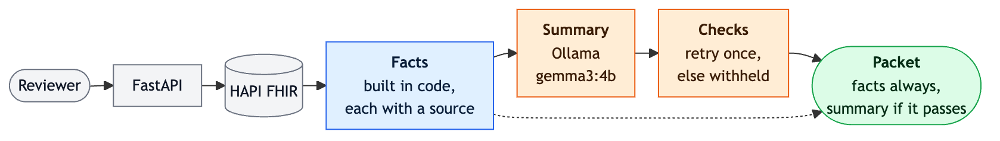

<!-- ORIGIN: AI — drafted by Claude Code from the measured results and the decisions recorded in the
     code comments; the decisions and fairness marks are Kiel's. -->

# Clinical Context Packet Service

Give the service a patient and it returns a **packet**. The packet has three lists from that
patient's health record: conditions, medications, and allergies. Every item includes the record it
came from. The packet also says what is missing, and it adds a short summary a reviewer can
scan.

The lists are built in code, from the record. A small local model (Ollama, `gemma3:4b`, running on
CPU) writes **only the summary**. The summary is checked before anyone sees it. This service does
not approve or deny care. It gathers evidence for a person to check.

The records follow FHIR, a standard format for health data. This demo stores them in HAPI, an open
source FHIR server, backed by Postgres. The patients are synthetic, from Synthea, so none of the
data is real.

**What is built:** HAPI holding all 1,180 Synthea patients, one API endpoint, the local summary,
and a one-page reviewer view.

**What I would improve first:** on a long chart, the summary can name a few conditions and read as
if those were all of them. That is the one place the evaluation missed its own bar. The results
are below.

## How to run

You need Docker, with about 10 GiB of memory (this was built with 9.7 GiB) and about 15 GB of
disk. The helper scripts and tests need Python 3.12 on your PATH as `python3.12`. On a Mac,
`brew install python@3.12` provides that command. If a `.venv` from another Python is already
there, delete it first with `rm -rf .venv`.

The block below is safe to paste as a whole. In order, it:

1. Creates a Python 3.12 virtualenv.
2. Copies `.env`. There are no secrets in it. This is a local demo on synthetic data.
3. Starts HAPI, Postgres, Ollama, and the API. The first start downloads `gemma3:4b` (3.3 GB).
4. Installs the locked Python packages into the virtualenv.
5. Downloads the pinned 1K Synthea sample (85 MB, checksum-verified).
6. Loads all 1,180 patients. This takes about 9 minutes. The demo and evaluation patients load first.
7. Checks `/health`, then requests one real packet.
8. Opens the reviewer page and prints that same packet as JSON.

```bash
python3.12 -m venv .venv
cp .env.example .env
docker compose up --build -d
make install
.venv/bin/python scripts/download_synthea.py
.venv/bin/python scripts/seed_hapi.py
make smoke
open http://localhost:8000
curl -s localhost:8000/v1/patients/2fa15bc7-8866-461a-9000-f739e425860a/clinical-context | python3 -m json.tool
```

- **The reviewer page** is at `localhost:8000`. Type a patient id, or click one of the examples.
  Facts from the FHIR record are blue. The summary is orange, and it is labeled as model text, not
  as part of the record. The page also shows what is missing. Every fact has a link that opens the
  source record in HAPI. The page is one HTML file, with no build step, and it makes no decision.
  A link such as `localhost:8000/#2fa15bc7-8866-461a-9000-f739e425860a` loads that patient. Source
  links use `PUBLIC_FHIR_BASE_URL` from `.env`. The default is `http://localhost:8080/fhir`. Change
  it if HAPI is reached at another address.
- The endpoint is `GET /v1/patients/{id}/clinical-context`. The id can be a HAPI id or an identifier
  such as the Synthea UUID above. Interactive docs are at `localhost:8000/docs`. HAPI's own web
  interface, for checking a source by hand, is at `localhost:8080`. Saved example packets (a
  deceased patient, an empty chart, a truncated list) are in [`examples/`](examples/).
- The first start is slow. HAPI is healthy after a minute or two, and the model takes about 15–20
  seconds to load. You can stop the seed and start it again. It will not load the same patient twice.
- `make test` runs 622 tests. They need no network, no model, and no Azure account. `make lint`
  checks style and types with ruff and mypy. `make install` and the container install the exact
  versions in `requirements.lock`. `make lock` re-pins those versions after a dependency change.
- `AS_OF_DATE=2019-09-16` in `.env` matters. The Synthea sample is frozen at that date, so ages
  calculated against today would be wrong. The example patient is 73 in the data and 80 today.
  Leave `AS_OF_DATE` unset when you point the service at a real EHR.

### Deploy to Azure (optional)

The same Docker Compose stack can run on one Azure VM. Instead of loading every patient over HTTP
again, the deploy restores a database dump.

`azure/make-dump.sh` writes a 150 MB dump of the running local database. Run the deploy with
`--dry-run` first. That prints every step and changes nothing. The real deploy needs `az login`,
and only the address you pass can connect. `azure/teardown.sh` deletes everything the deploy made.

```bash
azure/make-dump.sh
azure/deploy.sh --my-ip <your-ip> --dry-run
azure/deploy.sh --my-ip <your-ip>
azure/teardown.sh
```

**This has never been deployed.** The template compiles and lints. 37 tests pin the safety rules.
The dump and restore were proven locally: all 527,113 resources restore in 52 seconds, and a second
HAPI serves them correctly. No Azure subscription was used. Steps, cost, what is exposed, and why
deploy is manual (rather than running on every push) are in [`azure/README.md`](azure/README.md).

## How it works



A reviewer needs facts they can verify. Those facts come from code, and each one can be checked
against HAPI. The model only turns the facts into a sentence or two. If the summary breaks a rule,
it is withheld. The facts are still returned. Diagram source:
[`docs/data-flow.mmd`](docs/data-flow.mmd).

## Technical decisions

**Facts come from code. The model only writes the summary.**

The model never sees a patient id or a source link, and it cannot add a fact. Giving it the raw
FHIR record and asking it to build the packet was rejected. In that setup it could invent a source.

**Code is grouped by what it is allowed to touch.**

`fhir/` talks to HAPI. `packet/` builds the facts. That code is pure: no network, no model, and no
clock, so tests can pass it plain dictionaries. `llm/` is the only place a model is used. The HTTP
routes only connect those pieces. The tests use the same folder split.

**Every fact has a source, and each gap has a fixed shape.**

The original brief showed missing information as plain strings. Here each gap is
`{code, section, detail}`. A program can act on the code, and a person can still read the detail.
Allergies are in the packet because a reviewer must not miss one.

**The patient lookup tries two kinds of id.**

The service first treats the id as a HAPI id. If that misses, it searches by identifier. The
example id in the brief is a Synthea identifier, not a HAPI id. `GET Patient/<uuid>` returns 404
for it. A lookup that only tried the HAPI id would fail on the first example.

**"Current" means a small set of statuses. Old records that are still marked active are kept.**

Current conditions are those with status active, recurrence, or relapse. Current medications are
active or on-hold. Current allergies are active. Every other record is counted as excluded, and
the count is shown, so those records are not quietly dropped.

Some records are marked active even though they are plainly old. Examples are a cardiac arrest
from 1965, and entries that say "History of ...". Those stay in the packet. Calling them stale
would be a clinical judgment this service cannot defend.

**The client reads every page, sorts, then caps the list.**

One patient has 1,275 medication requests. The client follows every `next` link. If a search would
take more than 50 pages, the service returns 502. It does not silently stop early. Records are
sorted newest first, and only then cut to 25.

The client does not use `$everything`, and it does not ask the server to filter by status. Real
EHRs do not offer those the same way, so the demo does not depend on them.

**Ages use a fixed date, because the dataset is frozen.**

`as_of` is `2019-09-16`. Ages and the meaning of "current" are calculated against that date.

**A bad summary is dropped. The facts are still returned.**

The model must answer with exactly `{"summary": "..."}`. Ollama's structured-output mode is used,
and the service checks the shape again. The text must also pass these rules:

- At most 200 words.
- No identifiers.
- No approve, deny, or "medically necessary" language.
- No "stable" or "well controlled".
- No "none recorded" when that list has entries.
- No numbers that are not in the record.

If a check fails, the model gets one retry. The retry says what was wrong. Asking again with the
same prompt would repeat the same answer, because the temperature is 0. If the retry also fails,
the summary is marked unavailable and the reason is included. The facts are returned either way.

LangChain and LangGraph were rejected. They would add 24 packages and sit between this code and
the one request that decides the output. They would not make a 4B model more deterministic.

**The same packet should get the same summary.**

Temperature 0, `top_k` 1, and a fixed seed were not enough. One prompt came back worded three
different ways, depending on what Ollama still had in its prompt cache. A summary that has already
passed the checks is saved. A request waits at most 45 seconds for a summary. After that it
returns the facts, and the model finishes in the background so the next request can use the saved
text.

**A rule the model ignored is now enforced in code.**

The evaluation showed the model skipping the instruction to say that a patient is deceased. The
code now requires that sentence. Asking for it in the prompt was not enough.

**The reviewer page is separate from the API.**

The API still has one job: return the packet. The page only calls that endpoint. It builds the
HTML from text, not from markup in the record, because display names come from the record and must
not be treated as HTML. A source becomes a link only when it looks like `Type/id`. The patient id
goes in the URL fragment (`#...`). A browser does not send the fragment to the server, and the
server's access log prints query strings, so the id stays out of that log.

A front-end framework or a build step was rejected. Either one would take longer to explain than
the page itself.

**Azure runs the same Compose file on one VM, and the data arrives as a dump.**

Loading 1,180 bundles over HTTP takes about nine minutes. The dump is 150 MB and restores in under
a minute. Only the deployer's IP address can connect, and there is no default address. You have to
pass one.

A container service or a managed database was rejected. Either one would change what this demo is
showing. Deploying automatically on every push was also rejected. That would restore a database
and start a paid VM for every README edit.

**The error responses are part of the API contract.**

404, 409, 422, 502, and 500 each return one fixed sentence. Those responses are declared in the
OpenAPI schema at `/docs`. A packet is sent with `Cache-Control: no-store`, so a browser or proxy
does not keep a copy of a patient's record. The container installs from the lockfile, so a rebuild
next month cannot silently change a dependency version.

**HAPI holds the data, including the progress of a seed.**

Before loading a patient, the seed asks HAPI whether that patient is already there. An interrupted
load can resume without creating duplicates. HAPI runs on Postgres, so the data survives a restart.

**Logs do not contain a patient id.**

Application logs store a keyed hash instead of the id. The server's access log is redacted. HAPI's
search logging is turned down.

## Results

The grading rules were written down and committed before any result was measured, and they were
not changed afterward. The full write-up is [`eval/ten_patients.md`](eval/ten_patients.md). The
words behind every mark are in [`eval/`](eval/).

A summary is **fair** when a reviewer, reading it next to that packet's facts, would not be misled
about what the record says. Each miss gets one tag:

- **invented:** a fact the packet does not contain
- **omitted:** an active chronic condition left out in a way that reads as the full list
- **stale-as-current:** an old or stopped record presented as something the patient has now
- **overclaimed:** control or certainty the record does not give, such as "stable"
- **deceased-ignored:** a deceased patient described as living or as still on treatment, or never described as deceased

A summary with no tag is fair. One tag makes it unfair. Naming some of many conditions is allowed
when the summary says so, for example with "including" or "among others".

Two checks were done separately. A script compared every cited source with HAPI, without trusting
the service. I read each of the ten summaries next to its facts and marked it by the rules above.

The bar for this hand read was **at least 9 of 10 summaries fair**. Sources had to be perfect,
because those are assembled in code. Any source miss would be a bug.

### Ten patients, read one by one

The ten were chosen for range: young and old, sparse charts and busy ones, living and deceased, an
empty chart, many medications, and records that should be left out.

**The sources are sound.** All 157 cited sources exist and belong to the right patient. All 147
statuses match the record. All 147 names match the record. For these ten patients, every record
HAPI holds is accounted for. What the packet shows, plus what it says it left out, equals what
HAPI has.

**The fairness bar was missed.** 7 of 10 summaries were fair. The bar was 9. The first, stricter
read scored 5 of 10. Three more are close calls: Aaron's plural "events", Beatriz naming one of
six allergies, and Adam naming 3 of 6 conditions without saying the list was partial. Counting
those as fair reaches 8. Leaving them as misses stays at 5. The bar is missed either way.

**The first failure was a real bug.** Three of four deceased patients were never called deceased.
Floyd was 95 and deceased, with 1,275 medication requests. His summary said he was "recorded as
active with ... medications such as Furosemide ... and insulin". That reads as a living patient on
treatment. The words themselves matched the record, so a check that only looks at the wording
could not catch it. The fix was a rule about the patient: if the record says deceased, the summary
must say so. After that fix, all four deceased patients are described as deceased.

**What is still wrong.** On a long chart, the model names a few conditions as if they were the
whole list, and it does not say "including". Floyd's summary named 3 of 20, Shelly's 6 of 24, and
Adam's 3 of 6. A dropped allergy is not a miss under the rule as written. The rule only counts a
missing condition. Beatriz named one of six allergies. Andreas named none. Neither of those was
scored as unfair for that reason.

### A batch of 100 patients nobody had looked at

These 100 were drawn from patients outside the hand-read ten.

- 100 of 100 summaries were generated, and each answer had the required `{"summary": "..."}` shape.
- 714 of 714 cited sources were found and correct.
- All 300 lists were accounted for (conditions, medications, and allergies for each of the 100).
- 17 of 17 deceased patients were handled correctly.
- A summary was ready in 13.0 seconds at the median, and in 21.1 seconds at the 95th percentile.

Seven of those 100 were then read by hand. None of the seven were in the original ten. 6 of 7 were
fair. One omitted a condition.

About 13 of the 100 leave out a chronic condition without saying so. That number is an estimate
from matching words, not from reading all 100. The script's `partial_list` flag fired more often
than the hand read of those seven would support. It over-counts.

### Choosing the model

Three patients were run through each candidate model, using this service's own prompt and checks.
Each model was tried cold (loaded from nothing, so load time is included) and then warm (already
in memory).

| | passes the checks first try | cold / warm | tokens per second | fair (cold) |
| --- | --- | --- | --- | --- |
| llama3.2:3b | 4 of 6 | 27.1 s / 12.2 s | 6.7 | 2 of 3 |
| phi4-mini:3.8b | 4 of 6 | 21.4 s / 9.6 s | 5.3 | 1 of 3 |
| **gemma3:4b** | **6 of 6** | 26.6 s / **7.3 s** | 6.2 | 2 of 3 |

`gemma3:4b` was the only model that passed every check on the first try. The others ran past the
length limit on the busiest chart. It was also the fastest once warm, and it tied `llama3.2:3b`
on fairness.

This is a thin comparison. It is three patients, one run each. The fairness rule counts only a
missing condition as an omission, so a dropped allergy costs nothing. If dropped allergies counted,
`llama3.2:3b` would come out ahead. The models ran on CPU, which is what a laptop or a plain Azure
VM offers.

All timings were taken on an Apple M5, with 10 CPUs and 9.7 GiB given to Docker, while other heavy
processes were running. A quiet machine would be faster. These numbers are rougher than that.

## What I would do next, and why

1. **Make a partial list say that it is partial.** Put each list's size in the prompt, and reject a
   summary that names only some conditions unless it says so. Do the same for allergies. Then
   measure again on the 100, and read more of them by hand.

   This is first because it is the one bar the evaluation missed.

2. **Check that every claim in the summary traces to a listed fact.** The automatic checks already
   catch "none recorded" and numbers that are not in the record. They do not catch a short
   condition list that reads as the full list.

3. **Define `missing` for one authorization request, not for the whole chart.** Today, `missing`
   means something the chart lacks. A reviewer is usually asking a narrower question: what
   documentation is still needed for this request.

4. **Give the Azure deploy a production shape.** That means SMART-on-FHIR or Entra ID for login,
   secrets in Key Vault, an audit trail of who looked at which patient, and the model kept inside
   the payer's network so the record does not leave it. After that, an Epic or Cerner connector
   would use the same FHIR R4 queries with different authentication.

   None of that can be added onto this demo without redrawing who is trusted with the data. It is
   not done here. The deployment files exist, but they have never been run on Azure, and CI has
   not yet run on GitHub.

5. **If summary latency hurts, return the facts at once and the summary asynchronously.** The
   packet should not wait on the model. A larger model on a GPU is the other lever. The results
   suggest that would help the omissions most.

An automatic approve-or-deny decision is out of scope on purpose, because this service gathers
evidence for a person to check.
